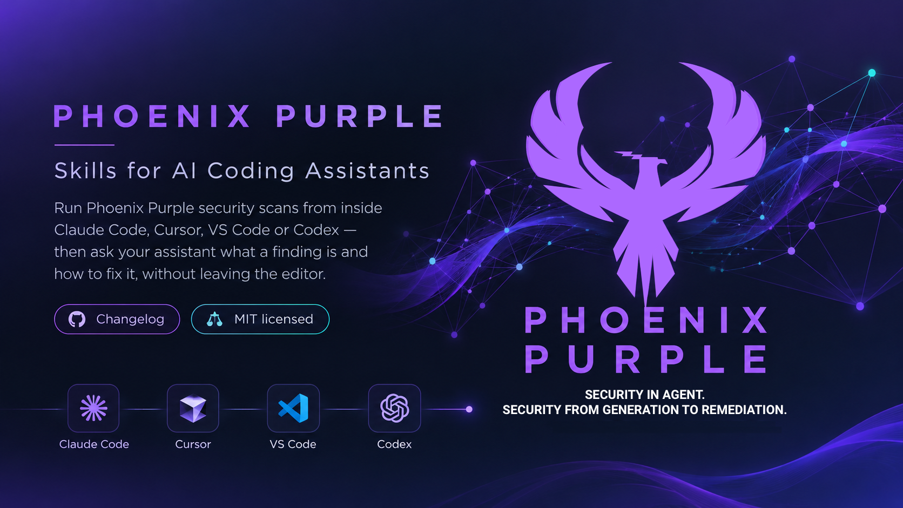
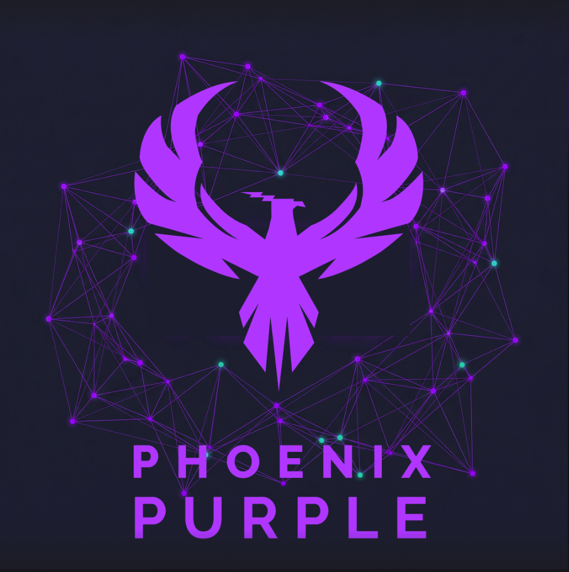

<p align="center">
  
</p>

<h1 align="center">Phoenix Purple — Skills for AI Coding Assistants</h1>

<p align="center">
  Run Phoenix Purple security scans from inside Claude Code, Cursor, VS Code or Codex —<br>
  then ask your assistant what a finding is and how to fix it, without leaving the editor.
</p>

<p align="center">
  <a href="https://github.com/securityphoenix/purple-skills/actions/workflows/validate.yml"></a>
  <a href="CHANGELOG.md"></a>
  <a href="LICENSE"></a>
</p>

---

## What you get

Three skills:

| Skill | What it does |
|---|---|
| **`purple-scan`** | Launch a scan in any of nine domains, read the findings back, and get per-finding remediation guidance |
| **`purple-graph-navigator`** | Explore your code as a knowledge graph — call chains, entry points, blast radius |
| **`purple-dev-flow`** | The day-to-day loop: index what changed, then scan it |

### The nine scan domains

| Domain | Launch | Read findings |
|---|---|---|
| SAST | `sast_scan` | `sast_findings` |
| SCA / SBOM | `scan_sca` | `sca_findings` |
| Secrets | `scan_secret` | `secret_findings` |
| Infrastructure as Code | `iac_scan` | `iac_findings` |
| Container | `container_scan` | `container_findings` |
| Zero-day | `zero_day_scan` | `zero_day_findings` |
| Assessment (OWASP / ASVS) | `run_assessment` | `assessment_findings` |
| Exploit hunt | `exploit_hunt_run` | `exploit_hunt_status` |
| Deep Hunt | `deephunt_start_run` | `deephunt_get_run` |

Or run the standard sweep in one call with `scan_all`.

### Remediation guidance

Ask about a specific finding and you get what it is, where it is, the code around it, and how to
fix it:

```
sast_scan            →  run the scan
sast_findings        →  read the list, copy a finding's "Stable ID"
finding_remediation  →  that one finding: what / where / code / fix
```

Two things worth knowing up front, because they are easy to get wrong:

- Use the **`Stable ID:`** line, not the `ID:` line. They are different values.
- A missing `Fix:` line means **nothing was found**, not "no fix needed". `finding_remediation`
  always ends with `Remediation Availability: RESOLVED | NONE_FOUND` so this is never ambiguous.

Remediation guidance currently covers **SAST findings**. Other domains return findings but no fix
text yet.

---

## Before you start

You need two things:

1. **A Phoenix Purple tenant URL**, e.g. `https://your-tenant.phoenix.security`.
2. **An MCP token** for that tenant. Create one in Phoenix under **Settings → API keys**.

Keep the token in an environment variable. Every configuration below reads it from there, so the
token never lands in a file you might commit:

```bash
export PHX_MCP_TOKEN="phx_at_..."
export PHX_BASE_URL="https://your-tenant.phoenix.security"
```

Add those to your shell profile (`~/.zshrc`, `~/.bashrc`) so they survive a new terminal.

---

## Install

Pick your assistant.

### Claude Code

Claude Code can install the skills as a plugin, in two commands:

```bash
claude plugin marketplace add securityphoenix/purple-skills
claude plugin install purple-security@phoenix-purple
```

Check it landed:

```bash
claude plugin list
```

You should see `purple-security@phoenix-purple` with status `enabled`.

Then connect the scanner. Copy [`mcp/claude-code.mcp.json`](mcp/claude-code.mcp.json) to `.mcp.json`
in your project root:

```bash
curl -fsSL https://raw.githubusercontent.com/securityphoenix/purple-skills/main/mcp/claude-code.mcp.json -o .mcp.json
```

It reads `PHX_BASE_URL` and `PHX_MCP_TOKEN` from your environment, so there is nothing to edit and
nothing secret in the file. Restart Claude Code.

### Cursor

Copy [`mcp/cursor.mcp.json`](mcp/cursor.mcp.json) to `.cursor/mcp.json` in your project (or
`~/.cursor/mcp.json` for every project), and replace `YOUR-TENANT` with your Phoenix host. The
token comes from `${env:PHX_MCP_TOKEN}`.

Cursor does not install Claude Code plugins. Copy the skills in by hand:

```bash
mkdir -p .cursor/skills
curl -fsSL https://github.com/securityphoenix/purple-skills/archive/refs/heads/main.tar.gz \
  | tar -xz --strip-components=4 -C .cursor/skills \
    purple-skills-main/plugins/purple-security/skills
```

### VS Code

Copy [`mcp/vscode.mcp.json`](mcp/vscode.mcp.json) to `.vscode/mcp.json` and replace `YOUR-TENANT`.
VS Code prompts you for the token the first time the server starts and stores it securely — so
there is no token in the file either.

### Codex

Codex has **no plugin marketplace**. Merge [`mcp/codex.config.toml`](mcp/codex.config.toml) into
`~/.codex/config.toml` (or `.codex/config.toml` for one project) and replace `YOUR-TENANT`. The
token is read from `PHX_MCP_TOKEN`.

Codex does not load `SKILL.md` files automatically. Clone this repo and point your `AGENTS.md` at
the skill you want:

```markdown
Security scanning: read plugins/purple-security/skills/purple-scan/SKILL.md before scanning.
```

---

## Check it works

Ask your assistant:

> List the Phoenix scan domains available on my tenant.

It should call `list_scan_domains` and come back with the domains your deployment actually has
enabled — which can be fewer than the nine above, since some are gated per deployment.

Then try a real scan:

> Run a SAST scan on `my-repo`, then tell me about the highest-severity finding.

---

## Troubleshooting

| Symptom | Cause | Fix |
|---|---|---|
| Assistant says the Phoenix tools do not exist | MCP config not loaded | Restart the assistant after writing the config file |
| `401 Unauthorized` | Token expired or not exported | Re-export `PHX_MCP_TOKEN`; mint a new token in Phoenix if needed |
| A domain is missing from `list_scan_domains` | Disabled on your deployment | Ask your Phoenix administrator to enable it |
| `finding_remediation` says "not found" | Wrong id | Use the `Stable ID:` line from `sast_findings`, not `ID:` |
| A finding has no `Fix:` line | No guidance resolved for it | Not an error — check `Remediation Availability` |
| Skill does not trigger by name | Plugin not enabled | `claude plugin list`, then `claude plugin enable purple-security@phoenix-purple` |

---

## What is not in this repo

This repo is the **customer-facing** part of Phoenix Purple: skills, the Claude Code plugin, and
MCP configuration. Deliberately not included:

- The Phoenix Purple backend itself.
- The full installation pack — connector, reverse proxy, CI templates, SBOM ingest client, session
  hooks and the `purple` CLI. Ask Phoenix Security if you need those.
- Internal test harnesses and QA reports.

Some of the skills' **REST fallback** steps reference a `scripts/purple` CLI that ships with the
full pack, not with this repo. The MCP path — the one these instructions set up — does not need
it.

---

## Support

- Issues with these skills: [open an issue](https://github.com/securityphoenix/purple-skills/issues)
- Phoenix Purple product: <https://phoenix.security>

---

<p align="center">
  
</p>

<p align="center">
  <sub><b>Security in agent. Security from generation to remediation.</b><br>MIT licensed · © 2026 Phoenix Security</sub>
</p>
